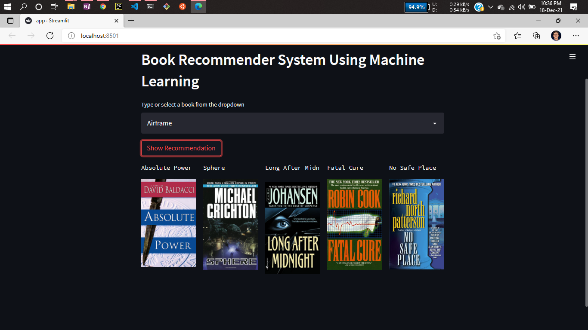

# Book Recommender System Using Machine Learning

This is a streamlit web application that can recommend various kinds of similar books based on an user interest.


# Demo:





# Dataset has been used:

* [Dataset link](https://www.kaggle.com/ra4u12/bookrecommendation)

# Concept used to build the model.pkl file : NearestNeighbors

1 . Load the data
	
2 . Initialise the value of k

3 . For getting the predicted class, iterate from 1 to total number of training data points

4 . Calculate the distance between test data and each row of training data. Here we will use Euclidean distance as our distance metric since it’s the most popular method. 

5 . Sort the calculated distances in ascending order based on distance values
	
6 . Get top k rows from the sorted array

# How to run?
### STEPS:

Clone the repository

```bash
https://github.com/entbappy/Books-Recommender-System-Using-Machine-Learning
```
### STEP 01- Create a conda environment after opening the repository

```bash
conda create -n books python=3.7.10 -y
```

```bash
conda activate books
```


### STEP 02- install the requirements
```bash
pip install -r requirements.txt
```


```bash
#run this file to generate the models

Books Recommender.ipynb
```

Now run,
```bash
streamlit run app.py
```


```bash
Author: Utpal Paul
Data ML Engineer
Email: utpalpaul108@gmail.com

```


